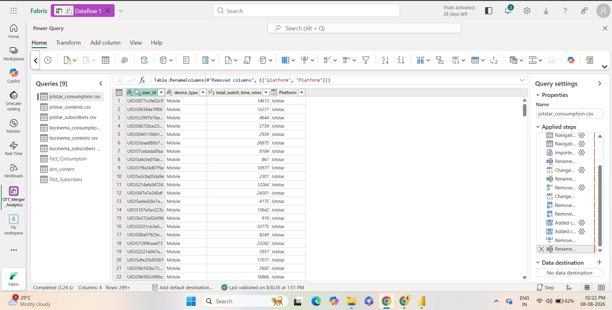
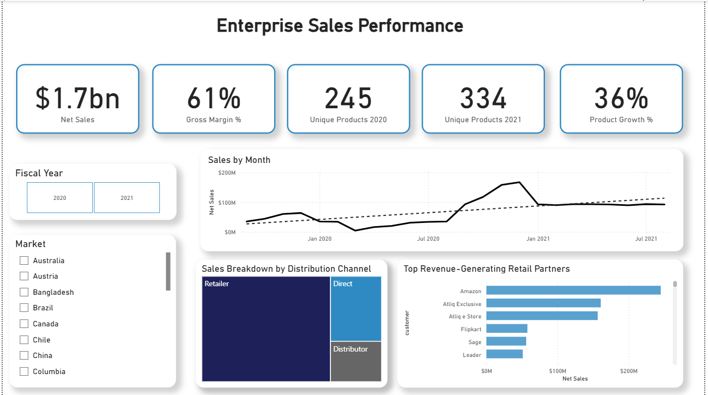
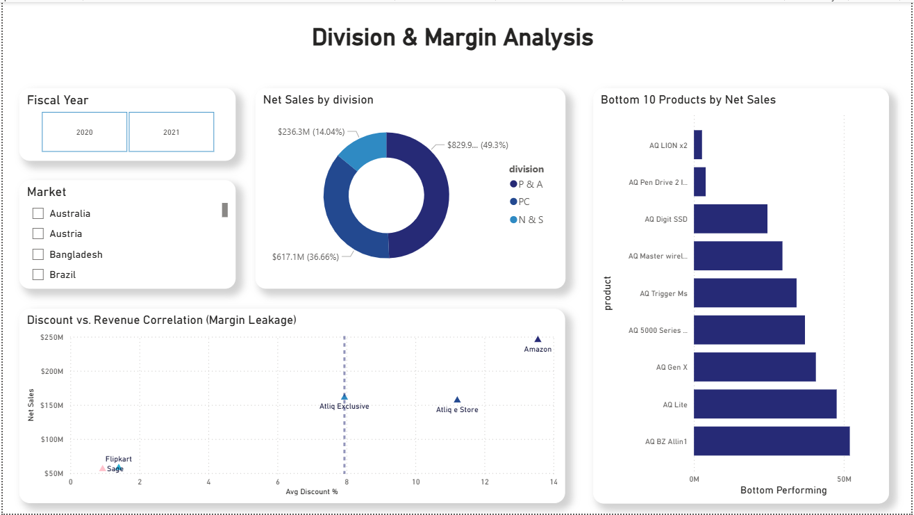

# OTT Merger: Subscriber Retention & Consumption Analytics Pipeline

**Tech Stack:** Microsoft Fabric | Dataflow Gen2 | Lakehouse | SQL Endpoint | Power BI | DAX  
**Repository Assets:**  
* 📊 **Dashboard File:** [`OTT_Merger_Retention_Dashboard.pbix`](./OTT_Merger_Retention_Dashboard.pbix) *(Live-connected visual layout)*  
* 🧮 **DAX Calculations:** [`dax_measures.txt`](./dax_measures.txt) *(Centralized Semantic Model logic)*  

---

## Executive Summary
Engineered an end-to-end cloud analytics solution using **Microsoft Fabric** to unify post-merger subscriber health and streaming telemetry across **Jotstar** and **LioCinema**. 

The pipeline automates raw data ingestion via **Dataflow Gen2** into an **OTT Lakehouse**, serving a centralized **Semantic Model** and interactive **Power BI Executive Dashboard** to track platform migration, margin performance, and viewer retention.

---

## Key Business Insights & Metrics
* **Enterprise Revenue:** Tracked **$1.7bn in Net Sales** with a **61% Gross Margin %** across target markets.
* **Churn & Retention Analysis:** Identified **Margin Leakage** patterns and isolated churn risks across key demographic segments.
* **Product Catalog Performance:** Evaluated product growth across 334 unique products and monitored distribution channel performance across direct, retail, and distributor networks.

---

## Architecture & Pipeline Implementation

### 1. Data Lineage & Lakehouse Architecture
The line-of-sight pipeline tracks automated ingestion from raw CSV telemetry through Dataflow Gen2, persisting Delta tables within the **OTT Lakehouse** and serving them via the **SQL Analytics Endpoint**.

---

### 2. ETL & Transformation Layer (Power Query / Dataflow Gen2)
Data cleaning and schema standardization steps applied in Power Query to handle multi-platform schema alignment:

---

## Power BI Executive Dashboard Views

### View 1: Enterprise Sales Performance
*Tracks high-level revenue trends, monthly sales performance, distribution channel splits, and top revenue-generating retail partners.*

---

### View 2: Division & Margin Analysis
*Analyzes sales distribution by product division, discount vs. revenue correlation (margin leakage), and bottom-performing product lines.*

